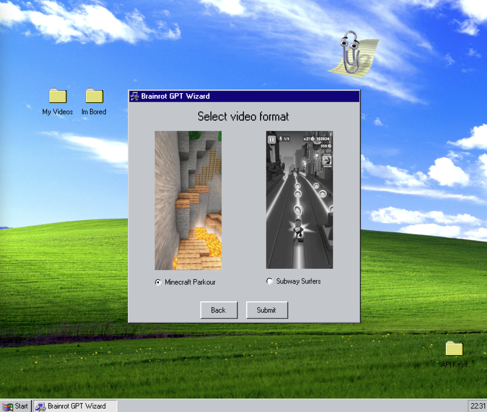

## BrainRot GPT

Turn PDFs into short form, digestible videos. Perfect if you have a sub-30 second attention span. 

[Live Site](https://brainrot-gpt-53atjhfps-tfrank11s-projects.vercel.app/)

## Technology Stack

## User Guide
- Login
- Upload PDF
- Pick video type (ie minecraft or subway surfers)
- Wait 1-1.5 mins while it generates

